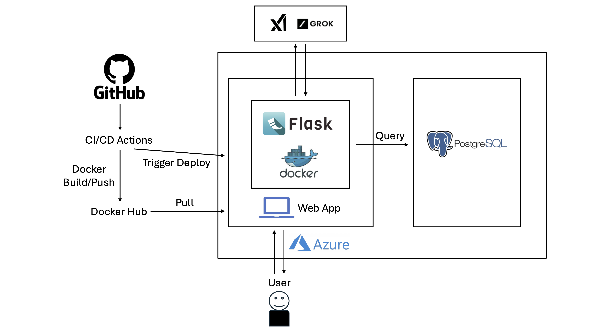

# IDS706 Final Project
# Data Engineering Final Project: Movie Trends & Analytics Platform

[](https://github.com/bionicotaku/IDS706_Final_Project/actions/workflows/cicd.yml)

## Team Members:
- Han Li
- Jingxuan Li
- Leo Chen
- Kaisen Yao

## Links
- Website: [https://www.ids706final.dingzhen.us/](https://www.ids706final.dingzhen.us/)
- Demo Video: [https://youtu.be/1AW61ni-LEU](https://youtu.be/1AW61ni-LEU)

## Project Description:
This project incorporated all the skills we learned in Data Engineering to create an application that offers services for analyzing movie popularity and genre trends over time. Users can input a start and end year to explore how different movie genres have evolved in popularity. Additionally, users can enter a specific year to view the most and least popular movies based on TMDB's popularity scores. The site also features an AI chat assistant for interactive user engagement using X.AI API. The following technologies are used for this project:

-   
-   
-   

## Project Architecture:


This is a Flask-based web application that adopts a microservices architecture and consists of the following core components:

### 1. Frontend
- Uses HTML5, CSS3, and JavaScript to build the user interface
- Utilizes Chart.js for data visualization
- Implements responsive design to ensure proper display across different devices

### 2. Backend
- Flask as the web framework
- PostgreSQL as the database
- RESTful API design
- Grok3 LLM integration for AI chat functionality

### 3. DevOps (Automated Development and Deployment)
- Docker containerization, hosted on Docker Hub
- Azure Web App deployment, using Infrastructure as Code. Also uses Azure Database for PostgreSQL to build the database
- GitHub Actions for automated CI/CD
- Uses environment variables to handle sensitive information like API keys

### 4. CI/CD Pipeline

This CI/CD workflow defined in `.github/workflows` automates the process of building a Docker container from the code repository and deploying it to an Azure Web App whenever code is pushed to the `main` branch or the workflow is manually triggered. It ensures seamless integration and deployment to the production environment.

1. Code is pushed to GitHub main branch
2. GitHub Actions triggers automatic testing and building
3. Docker image is built
4. Image is pushed to Docker Hub
5. Automatic deployment to Azure Web App

## Infrastructure as Code

This project uses Azure Resource Manager (ARM) templates for deploying the IDS706 project infrastructure, automatically creating the following resources:

- Web App: Basic (B3) tier with Docker container
- Database: PostgreSQL Flexible Server (Standard_B1ms)
- Location: East US (web app) and East US 2 (database)

The process is as follows:
1. First, `az login` to log into Azure, then navigate to the project's `ids706-infrastructure` folder
2. Create resource group:
```
az group create --name ids706final --location eastus
```

3. Deploy infrastructure:
```
az deployment group create \
  --resource-group ids706final \
  --template-file template.json \
  --parameters @parameters.json \
  --parameters administratorLoginPassword=<your-secure-password>
```

4. Configure services (such as firewall):
```
az postgres flexible-server firewall-rule create \
  --resource-group ids706final \
  --name ids706 \
  --rule-name allowapp \
  --start-ip-address <web-app-ip> \
  --end-ip-address <web-app-ip>
```

## Load Testing:
We used the `Locust` library to perform load testing on our Flask application. The code can be found in load_test.py. The load test on Locust was configured to test 10,000 requests per second.
```
locust -f load_test.py --host=https://www.ids706final.dingzhen.us
```
Here are the test results:


Due to our Azure Student Subscription limitations, we could only use Standard S3 SKU with a maximum of 10 instances. Each instance was configured with 9 workers and 4 threads to achieve maximum concurrent capacity.
As shown in these graphs, the peak requests per second reached around 1,600, with a stable maximum load of approximately 1,200. When reaching 10,000 users per second, the 95th percentile latency exceeded 60,000ms, indicating maximum load capacity. On average, 50% of the requests had latency within 500ms.

## Local Deployment
Note that you need to create a `.env` file beforehand, containing the `XAI_API_KEY` environment variable to use the Grok3 large language model chat functionality.

You can use .devcontainer configuration for Github/Gitlab Codespaces:
- `make install` Install dependencies
- `make run` Run the application

Or directly use Docker:
- `make docker-build` Build Docker image
- `make docker-run` Run Docker container

## The Application:
The application is deployed on Azure Web App Services and uses CloudFlare for domain services to enable custom domain usage.

## Application Overview: Movie Trend Analysis and AI Chat Assistant

This project is a web application designed to analyze movie trends and provide an AI chat assistant. It features two main functionalities:

1. **AI Chat Assistant**
Users can interact with the latest released Grok3 large language model. If users have previously requested movie analysis data, this data will automatically be sent to the backend as context during subsequent conversations.

The design of the page is clean and modern, utilizing CSS to ensure a responsive and visually appealing experience across different devices.


2. **Explore Movie Genres Over Time**
This service allows users to analyze the popularity of different movie genres over a specified time range. It provides the following inputs:

- **Start Year**: The first year in the analysis range.  
- **End Year**: The last year in the analysis range.  

**Output**: A stacked bar chart where:  
- The x-axis represents the years within the selected range.
- The y-axis shows the count of movies released each year.
- Each genre is represented by a different color in the stack, showing its contribution to the total number of movies for that year.

This visualization helps users identify trends in genre preferences over time, such as the rise or decline of specific genres.


3. **Top Movies by TMDB Popularity**
This service displays the most and least popular movies based on TMDB's popularity scores. It provides the following input:  

- **Year**: Specify a year to analyze the movies released that year.  

**Output**: A bar chart where:  
- The top 5 movies are displayed in green bars, representing the highest popularity scores.
- The bottom 5 movies are displayed in red bars, representing the lowest popularity scores.
- The x-axis shows movie titles, and the y-axis shows their popularity scores.

This visualization highlights the standout successes and underperformers in terms of popularity for the selected year.


## Chat Interface Page:
This page is the chat interface where users can chat with the AI chat assistant. The chat assistant is built using X.AI API. The chat interface is built using Flask and HTML.

## Microservice
In this project, Flask serves as a microservice framework to build and deploy the web application for movie trend analysis and AI chat assistance. Flask, being lightweight, is ideal for creating small-scale microservices. It manages routing, handling requests for movie genre and popularity analysis, and returns data in JSON format. The application integrates with HTML templates to generate dynamic web pages, using JavaScript and Chart.js for data visualization. Flask is containerized using Docker, ensuring consistent deployment across environments, and is deployed on platforms like Azure Web App Services. This microservice architecture allows for modular, scalable design, facilitating future enhancements and maintenance.

## Data Engineering
In our project, we use Flask to create API endpoints and psycopg2 to connect to and query the PostgreSQL database using SQL, with PostgreSQL serving as the backend for data storage and analysis. Additionally, we use the ast module to parse strings into Python expressions. These technologies collectively support extracting and analyzing movie data from the database and providing data services through APIs.

## AI Tools
1. ChatGPT

We utilized ChatGPT to assist in debugging and optimizing our frontend UI. By leveraging its capabilities, we were able to identify and resolve issues more efficiently, as well as enhance the overall user interface design to ensure a more intuitive and visually appealing experience for our users.
